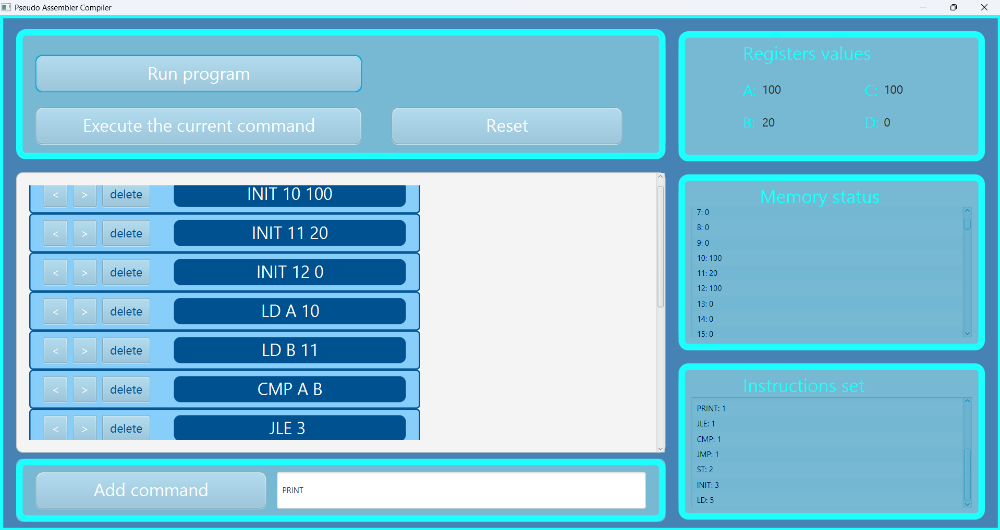

# CPU_fx - Pseudo Assembler Compiler

Эмулятор простого процессора с графическим интерфейсом на JavaFX. Позволяет создавать и выполнять программы на псевдоассемблере, отслеживать состояние регистров и памяти.
## Скриншоты



## Возможности

- **Создание программ** через графический интерфейс
- **Выполнение команд** пошагово или полностью
- **Отслеживание состояния** регистров (A, B, C, D) и памяти
- **Анализ программы** - подсчёт количества каждой инструкции
- **Визуальное выделение** текущей выполняемой команды
- **Управление списком команд** (добавление, удаление, перемещение)

## Поддерживаемые команды

### Команды передачи данных
| Команда | Описание | Синтаксис | Пример |
|---------|----------|-----------|--------|
| INIT | Инициализация ячейки памяти | `INIT <адрес> <значение>` | `INIT 10 5` |
| LD | Загрузка из памяти в регистр | `LD <регистр> <адрес>` | `LD A 10` |
| ST | Сохранение регистра в память | `ST <адрес> <регистр>` | `ST 20 B` |
| MV | Копирование между регистрами | `MV <приёмник> <источник>` | `MV C A` |

### Арифметические команды
| Команда | Описание | Синтаксис | Пример |
|---------|----------|-----------|--------|
| ADD | Сложение | `ADD` | `ADD` (A + B → D) |
| SUB | Вычитание | `SUB` | `SUB` (A - B → D) |
| MUL | Умножение | `MUL <число1> <число2>` | `MUL 5 3` |
| DIV | Деление | `DIV` | `DIV` (A / B → D) |

### Команды переходов
| Команда | Описание | Синтаксис | Пример |
|---------|----------|-----------|--------|
| CMP | Сравнение | `CMP <регистр1> <регистр2>` | `CMP A B` |
| JMP | Безусловный переход | `JMP <адрес>` | `JMP 5` |
| JE | Переход если равно | `JE <адрес>` | `JE 10` |
| JNE | Переход если не равно | `JNE <адрес>` | `JNE 10` |
| JG | Переход если больше | `JG <адрес>` | `JG 10` |
| JGE | Переход если больше или равно | `JGE <адрес>` | `JGE 10` |
| JL | Переход если меньше | `JL <адрес>` | `JL 10` |
| JLE | Переход если меньше или равно | `JLE <адрес>` | `JLE 10` |

### Сервисные команды
| Команда | Описание | Синтаксис | Пример |
|---------|----------|-----------|--------|
| PRINT | Вывод значений регистров | `PRINT` | `PRINT` |

## Установка и запуск

### Требования
- Java 11 или выше
- Maven (или использование встроенного Maven Wrapper)

## Использование
### Добавление команды
- Введите команду в текстовое поле в формате: `КОМАНДА [аргументы]`
- Нажмите кнопку "Add command"
- Команда появится в списке

### Примеры ввода

| №  |    Command     | Execution result               |
|:--:|:--------------:|:-------------------------------|
| 00 | `INIT 10 100`  | mem[10] = 100                  |
| 01 |  `INIT 11 20`  | mem[11] = 20                   |
| 02 |  `INIT 12 0`   | mem[12] = 0                    |
| 03 |    `PRINT`     | 0, 0, 0, 0                     |
| 04 |   `LD A 10`    | reg_A = mem[10] (100)          |
| 05 |   `LD B 11`    | reg_B = mem[11] (20)           |
| 06 |   `CMP A B`    | reg_A (100) < reg_B (20) false |
| 07 |    `JLE 4`     | nope                           |
| 08 |   `LD A 10`    | reg_A = mem[10] (100)          |
| 09 |   `ST 12 A`    | mem[12] = reg_A (100)          |
| 10 |    `JMP 13`    | jump to 13 line                |
| 11 |   `LD B 11`    | reg_B = mem[11] (20)           |
| 12 |   `ST 12 B`    | mem[12] = reg_B ()             |
| 13 |   `LD C 12`    | reg_C = mem[12]                |        
| 14 |    `PRINT`     | 100, 20, 100, 0                |                

### Выполнение программы
- Run program - выполнить все команды автоматически
- Execute the current command - выполнить команды пошагово
- Reset - сбросить состояние процессора

### Управление списком команд
- `<` - переместить команду вверх
- `>` - переместить команду вниз
- `delete` - удалить команду

### Формат команд
- Команда и аргументы разделяются пробелами
- Адреса памяти: целые числа от 0 до 1023
- Имена регистров: A, B, C, D (заглавные латинские буквы)

### Пример программы
```assembly
# Заполнение массива
INIT 0 1          # arr[0] = 1
INIT 1 2          # arr[1] = 2
INIT 2 3          # arr[2] = 3
INIT 3 4          # arr[3] = 4

# Суммирование
LD A 0            # A = arr[0]
LD B 1            # B = arr[1]
ADD               # D = A + B
ST 10 D           # сохраняем сумму
```

### Примечания
- Деление на ноль не обрабатывается - избегайте `DIV` с `B = 0`
- Память имеет размер 1024 ячейки
- Все значения хранятся как 32-битные целые числа
- Флаги сравнения автоматически сбрасываются после условных переходов

### Технологии
- Java 11+
- JavaFX 17.0.6
- Maven
- FXML для разметки интерфейса

## Архитектура проекта
```text
com.example.cpu_fx/
├── CPU_Application.java      # Точка входа JavaFX
├── CPU.java                  # Реализация процессора
├── ICPU.java                 # Интерфейс процессора
├── Program.java              # Управление программой
├── IProgram.java             # Интерфейс программы
├── Command.java              # Модель команды
├── Executor.java             # Исполнитель программы
├── CommandController.java    # Контроллер команды
├── CPUappController.java     # Главный контроллер
├── ProgramAnalyzer.java      # Анализ инструкций
├── BCPU.java / BProgram.java # Singleton фабрики
└── IObserver.java            # Интерфейс наблюдателя
```